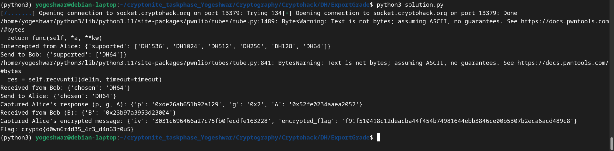

- Connecting to the server we get the following message
```
    Intercepted from Alice: {'supported': ['DH1536', 'DH1024', 'DH512', 'DH256', 'DH128', 'DH64']}
```
- Since DH64 is the weakest, we will remove the others so that only DH64 is supported.
    - DH1536: Diffie-Hellman with a 1536-bit prime.
    - DH1024: Diffie-Hellman with a 1024-bit prime.
    - DH512: Diffie-Hellman with a 512-bit prime.
    - DH256: Diffie-Hellman with a 256-bit prime.
    - DH128: Diffie-Hellman with a 128-bit prime.
    - DH64: Diffie-Hellman with a 64-bit prime.
    
- Sending the modifiedd supported list to Bob, we get the response 
```
Received from Bob: {'chosen': 'DH64'}
```
- Now we send this response to Alice, we get 
```
Captured Alice's response: {'p': '0xde26ab651b92a129', 'g': '0x2', 'A': '0xd3098f11c64353a'}

```
- Now Bob sends his values
```
Received from Bob (B): {'B': '0xdc77b6087130b69d'}
```
- Alice sends encrypted message
```
Captured Alice's encrypted message: {'iv': 'c97afae606ffc9fff2ef343a8607b469', 'encrypted_flag': 'c07763450e32333facd5c056807a67793397ed21fb1e58bb9c7e3f44a5af5428'}
```
- Since the value of `p` is small we can brutforce to find the value of `a`
 - A = g^a % p
 - To find a we find the discrete logarithm of A with respect to g modulo p.
```
a = discrete_log(p, A, g)

```
- Then decrypt the encrypted message
```

sha1 = hashlib.sha1()
sha1.update(str(shared_secret).encode('ascii'))
key = sha1.digest()[:16]

iv = bytes.fromhex(encrypted['iv'])
ciphertext = bytes.fromhex(encrypted['encrypted_flag'])
cipher = AES.new(key, AES.MODE_CBC, iv)
plaintext = cipher.decrypt(ciphertext)
flag = plaintext.decode('utf-8').strip()  

```


- Flag: crypto{d0wn6r4d35_4r3_d4n63r0u5}
