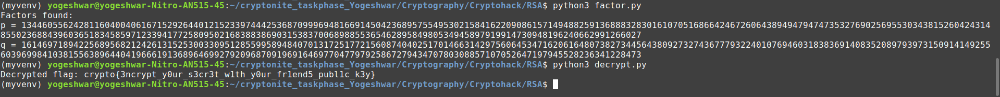

# CrossedWires

## Objective
- Decrypt the encrypted flag

## Initial Observations
- I knew nothing about RSA, so I started researching
- Given:     
[output.txt](output_434cbf2b937bac1177bed299b2049a92.txt) 
[source.py](source_b3c3c786c649d363d27995545cf95dab.py)
```
from Crypto.Util.number import getPrime, long_to_bytes, bytes_to_long, inverse
import math
from gmpy2 import next_prime

FLAG = b"crypto{????????????????????????????????????????????????}"

p = getPrime(1024)
q = getPrime(1024)
N = p*q
phi = (p-1)*(q-1)
e = 0x10001
d = inverse(e, phi)

my_key = (N, d)

friends = 5
friend_keys = [(N, getPrime(17)) for _ in range(friends)]

cipher = bytes_to_long(FLAG)

for key in friend_keys:
    cipher = pow(cipher, key[1], key[0])

print(f"My private key: {my_key}")
print(f"My Friend's public keys: {friend_keys}")
print(f"Encrypted flag: {cipher}")

```

## Approach

 - Some reading and watching                           
    - [ The RSA Encryption Algorithm (1 of 2: Computing an Example) ](https://youtu.be/4zahvcJ9glg)
    - [ The RSA Encryption Algorithm (2 of 2: Generating the Keys) ](https://youtu.be/oOcTVTpUsPQ)
    - [ RSA Encryption From Scratch - Math & Python Code ](https://youtu.be/D_PfV_IcUdA)
    - [RSA: how to factorize N given d](https://www.di-mgt.com.au/rsa_factorize_n.html)

- ### Algorithm:
``` 
Algorithm Input: N, e, d.
Output: p and q where pq=N.

    [Initialize] Set k←de−1

.
[Try a random g] Choose g
at random from {2,…,N−1} and set t←k
.
[Next t] If t
is divisible by 2, set t←t/2 and x←gtmodN
. Otherwise go to step 2.
[Finished?] If x>1
and y=gcd(x−1,N)>1 then set p←y and q←N/y, output (p,q) and terminate the algorithm. Otherwise go to step 3  
```
- From what I understand, the flag has been encrypted multiple (5 friends) times
- To get back the flag I'll have to decrypt the final encrypted flag wrt first friend, then the result of this operation will be decrypted wrt second friend and so on until the fifth friend and then convert the resulting number into readable text.
- Now to write a code which calculates the factors `p` and `q` according to the algorithm given in challenge description and then from their we can find the `phi` and then decrypt the flag using each friends public key (`N` is same for all the friends, as it should be)
#### With the help of ChatGPT
- Wrote a code to find p and q [factor.py](factor.py)


 ```
 from Crypto.Util.number import inverse, long_to_bytes
import math
from gmpy2 import next_prime

N = 21711308225346315542706844618441565741046498277716979943478360598053144971379956916575370343448988601905854572029635846626259487297950305231661109855854947494209135205589258643517961521594924368498672064293208230802441077390193682958095111922082677813175804775628884377724377647428385841831277059274172982280545237765559969228707506857561215268491024097063920337721783673060530181637161577401589126558556182546896783307370517275046522704047385786111489447064794210010802761708615907245523492585896286374996088089317826162798278528296206977900274431829829206103227171839270887476436899494428371323874689055690729986771

e = 65537

d = 2734411677251148030723138005716109733838866545375527602018255159319631026653190783670493107936401603981429171880504360560494771017246468702902647370954220312452541342858747590576273775107870450853533717116684326976263006435733382045807971890762018747729574021057430331778033982359184838159747331236538501849965329264774927607570410347019418407451937875684373454982306923178403161216817237890962651214718831954215200637651103907209347900857824722653217179548148145687181377220544864521808230122730967452981435355334932104265488075777638608041325256776275200067541533022527964743478554948792578057708522350812154888097

k = d * e - 1

def factor_N():
    g = 2
    while g < N:
        t = k
        while t % 2 == 0:
            t = t // 2
            x = pow(g, t, N)
            y = math.gcd(x - 1, N)
            if x > 1 and y > 1:
                p = y
                q = N // y
                return p, q
        g = int(next_prime(g))
    return None, None

p, q = factor_N()

if p is None or q is None:
    print("Failed to factor N")
else:
    print("Factors found:")
    print(f"p = {p}")
    print(f"q = {q}")


 ```

-  Wrote a code which iteratively decrypts the encrypted flag using each friend's key [decrypt.py](decrypt.py)
 ```
 from Crypto.Util.number import long_to_bytes, inverse

# Given values
p = 134460556242811604004061671529264401215233974442536870999694816691450423689575549530215841622090861571494882591368883283016107051686642467260643894947947473532769025695530343815260424314855023688439603651834585971233941772580950216838838690315383700689885536546289584980534945897919914730948196240662991266027
q = 161469718942256895682124261315253003309512855995894840701317251772156087404025170146631429756064534716206164807382734456438092732743677793224010769460318383691408352089793973150914149255603969984103815563896440419666191368964699279209687091969164697704779792586727943470780308857107052647197945528236341228473
N = 21711308225346315542706844618441565741046498277716979943478360598053144971379956916575370343448988601905854572029635846626259487297950305231661109855854947494209135205589258643517961521594924368498672064293208230802441077390193682958095111922082677813175804775628884377724377647428385841831277059274172982280545237765559969228707506857561215268491024097063920337721783673060530181637161577401589126558556182546896783307370517275046522704047385786111489447064794210010802761708615907245523492585896286374996088089317826162798278528296206977900274431829829206103227171839270887476436899494428371323874689055690729986771
phi = (p - 1) * (q - 1)

# List of public keys from friends (N is the same for all, e is different)
friend_keys = [
    (N, 106979),
    (N, 108533),
    (N, 69557),
    (N, 97117),
    (N, 103231)
]

# Encrypted flag (ciphertext)
ciphertext = 20304610279578186738172766224224793119885071262464464448863461184092225736054747976985179673905441502689126216282897704508745403799054734121583968853999791604281615154100736259131453424385364324630229671185343778172807262640709301838274824603101692485662726226902121105591137437331463201881264245562214012160875177167442010952439360623396658974413900469093836794752270399520074596329058725874834082188697377597949405779039139194196065364426213208345461407030771089787529200057105746584493554722790592530472869581310117300343461207750821737840042745530876391793484035024644475535353227851321505537398888106855012746117 # Replace with actual ciphertext

# Iteratively decrypt the flag using each friend's public key
for _, e in reversed(friend_keys):  # Reverse order of encryption
    d = inverse(e, phi)  # Compute private key for this layer
    ciphertext = pow(ciphertext, d, N)  # Decrypt this layer

# Convert final decrypted value to plaintext
plaintext_flag = long_to_bytes(ciphertext)

# Output the flag
print(f"Decrypted flag: {plaintext_flag.decode('utf-8')}")

 ```

 

## Flag
crypto{3ncrypt_y0ur_s3cr3t_w1th_y0ur_fr1end5_publ1c_k3y}

## Summary
- Used `my private key` and `my public to key` find out `p` and `q`
- Since `N` is same for all the friends, `p` and `q` are same too, calculated `phi`
- Used `my private key`, each `friend's public key` and `phi`  to decrypt the encrypted message corresponding to each friend (Using the output of one operation as input to another iteratively)
- Decoding the final output (utf-8)