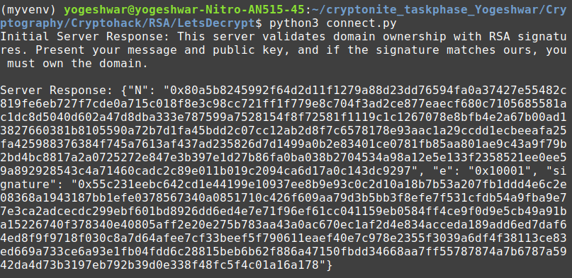

# Lets Decrypt

## Approach
- Looking at the [13391.py](13391_5bb4e548ed254cef357799685c887460.py) file and having no clue where to start I asked ChatGPT what the code does
- The script simulates a server that validates domain ownership using RSA signatures
- I send a `get_signature` request to the server to get `N`, `E` and the `signature`
- Then, I have to craft a message with the format `"I am Mallory.*own CryptoHack.org"` 
- Since the original signature is being calculated by converting the original message to `emsa_pkcs1_v15` encoding, I'll have to convert my message using the same format
- We want the `digest` of the `crafted_message` to be same as the `calculated digest`
- We control the `N` and `E` from which the `signature` of our `crafted_message` will be derived for the `verify` request
- Since the signature of our crafted message will be different we need to manipulate N and E such that calculated_digest=digest 


```
required condition: calculated_digest=digest 
=> original_signature % N = digest (keeping E=1)
=> original_signature=kN + digest 
=> N=(original_signature-digest)/k
taking k=1
=> N = original_signature - digest 
```
- Send a `verify` request with the `crafted_message`, and our chosen `N,E`
- [verify.py](verify.py)


## Flag
crypto{dupl1c4t3_s1gn4tur3_k3y_s3l3ct10n}


