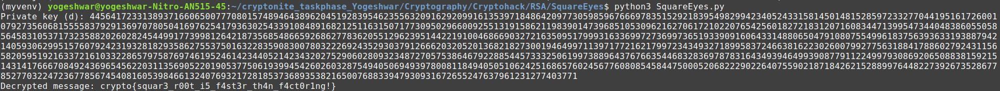

# Square Eyes

## Objective


## Initial Observations
- The description and name of the challenge suggests `N` is a perfect square
- The formula for `N` becomes `N=p^2` 
- What I initially thought: The formula`phi` becomes `phi=(p-1)^2`

```
n = 535860808044009550029177135708168016201451343147313565371014459027743491739422885443084705720731409713775527993719682583669164873806842043288439828071789970694759080842162253955259590552283047728782812946845160334801782088068154453021936721710269050985805054692096738777321796153384024897615594493453068138341203673749514094546000253631902991617197847584519694152122765406982133526594928685232381934742152195861380221224370858128736975959176861651044370378539093990198336298572944512738570839396588590096813217791191895941380464803377602779240663133834952329316862399581950590588006371221334128215409197603236942597674756728212232134056562716399155080108881105952768189193728827484667349378091100068224404684701674782399200373192433062767622841264055426035349769018117299620554803902490432339600566432246795818167460916180647394169157647245603555692735630862148715428791242764799469896924753470539857080767170052783918273180304835318388177089674231640910337743789750979216202573226794240332797892868276309400253925932223895530714169648116569013581643192341931800785254715083294526325980247219218364118877864892068185905587410977152737936310734712276956663192182487672474651103240004173381041237906849437490609652395748868434296753449
e = 65537
ct = 222502885974182429500948389840563415291534726891354573907329512556439632810921927905220486727807436668035929302442754225952786602492250448020341217733646472982286222338860566076161977786095675944552232391481278782019346283900959677167026636830252067048759720251671811058647569724495547940966885025629807079171218371644528053562232396674283745310132242492367274184667845174514466834132589971388067076980563188513333661165819462428837210575342101036356974189393390097403614434491507672459254969638032776897417674577487775755539964915035731988499983726435005007850876000232292458554577437739427313453671492956668188219600633325930981748162455965093222648173134777571527681591366164711307355510889316052064146089646772869610726671696699221157985834325663661400034831442431209123478778078255846830522226390964119818784903330200488705212765569163495571851459355520398928214206285080883954881888668509262455490889283862560453598662919522224935145694435885396500780651530829377030371611921181207362217397805303962112100190783763061909945889717878397740711340114311597934724670601992737526668932871436226135393872881664511222789565256059138002651403875484920711316522536260604255269532161594824301047729082877262812899724246757871448545439896

```


## Approach
- We know the value of `N` and `e`. We can find `p` from the above mentioned formula
- From `p` we can find `phi`
- I was getting errors when I use `phi=(p-1)^2`, So I researched (about totient function) and found out that `phi` is actually `phi=p*(p-1)` and not `phi=(p-1)^2`.
    - Why? https://youtu.be/NgZ33qr5WHM?t=216
    - The value of totient function of `p^2` is the number of co-prime numbers (CO-PRIME with `p^2`) in the range [1,p^2]. We know that `p` is prime (RSA) so the factors of `p^2` are `p,p`. Hence, we need to remove all the multiples of p from [1,p^2] and the remaining part will be the number of co-prime numbers i.e the totient function. Number of multiples of `p` in [1,p^2] is `p`. Total numbers in the set: `p^2`. Value of totien function=`p^2-p`. 

    ```
    Example:

    If p=5 then:

    The numbers in the range [1, 5^2] are [1, 2, 3, 4, 5, 6, 7, 8, 9, 10, 11, 12, 13, 14, 15, 16, 17, 18, 19, 20, 21, 22, 23, 24, 25].

    The multiples of 5 are [5, 10, 15, 20, 25].

    So, the numbers that are co-prime with 5^2=25 are those that are not in the list of multiples of 5.

    Therefore, ϕ(25)=25−5=20
    ```
    
- From `phi` and `e` we can find `d`
- Flag can be decrypted since we know `N` and `d` and `encrypted flag`

[Python code](SquareEyes.py)
```
import math
from Crypto.Util.number import inverse, long_to_bytes

N = 535860808044009550029177135708168016201451343147313565371014459027743491739422885443084705720731409713775527993719682583669164873806842043288439828071789970694759080842162253955259590552283047728782812946845160334801782088068154453021936721710269050985805054692096738777321796153384024897615594493453068138341203673749514094546000253631902991617197847584519694152122765406982133526594928685232381934742152195861380221224370858128736975959176861651044370378539093990198336298572944512738570839396588590096813217791191895941380464803377602779240663133834952329316862399581950590588006371221334128215409197603236942597674756728212232134056562716399155080108881105952768189193728827484667349378091100068224404684701674782399200373192433062767622841264055426035349769018117299620554803902490432339600566432246795818167460916180647394169157647245603555692735630862148715428791242764799469896924753470539857080767170052783918273180304835318388177089674231640910337743789750979216202573226794240332797892868276309400253925932223895530714169648116569013581643192341931800785254715083294526325980247219218364118877864892068185905587410977152737936310734712276956663192182487672474651103240004173381041237906849437490609652395748868434296753449
e = 65537  

square_root = math.isqrt(N)
p = square_root
q = p
phi = p*p-p
d = inverse(e, phi)

print(f"Private key (d): {d}")

C =  222502885974182429500948389840563415291534726891354573907329512556439632810921927905220486727807436668035929302442754225952786602492250448020341217733646472982286222338860566076161977786095675944552232391481278782019346283900959677167026636830252067048759720251671811058647569724495547940966885025629807079171218371644528053562232396674283745310132242492367274184667845174514466834132589971388067076980563188513333661165819462428837210575342101036356974189393390097403614434491507672459254969638032776897417674577487775755539964915035731988499983726435005007850876000232292458554577437739427313453671492956668188219600633325930981748162455965093222648173134777571527681591366164711307355510889316052064146089646772869610726671696699221157985834325663661400034831442431209123478778078255846830522226390964119818784903330200488705212765569163495571851459355520398928214206285080883954881888668509262455490889283862560453598662919522224935145694435885396500780651530829377030371611921181207362217397805303962112100190783763061909945889717878397740711340114311597934724670601992737526668932871436226135393872881664511222789565256059138002651403875484920711316522536260604255269532161594824301047729082877262812899724246757871448545439896
M = pow(C, d, N)

decrypted_message = long_to_bytes(M)

print(f"Decrypted message: {decrypted_message.decode('utf-8')}")

```



## Flag
crypto{squar3_r00t_i5_f4st3r_th4n_f4ct0r1ng!}