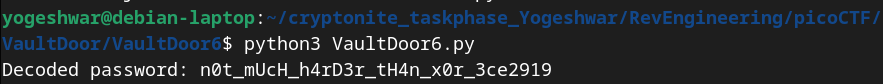

```
   public boolean checkPassword(String password) {
        if (password.length() != 32) {
            return false;
        }
        byte[] passBytes = password.getBytes();
        byte[] myBytes = {
            0x3b, 0x65, 0x21, 0xa , 0x38, 0x0 , 0x36, 0x1d,
            0xa , 0x3d, 0x61, 0x27, 0x11, 0x66, 0x27, 0xa ,
            0x21, 0x1d, 0x61, 0x3b, 0xa , 0x2d, 0x65, 0x27,
            0xa , 0x66, 0x36, 0x30, 0x67, 0x6c, 0x64, 0x6c,
        };
        for (int i=0; i<32; i++) {
            if (((passBytes[i] ^ 0x55) - myBytes[i]) != 0) {
                return false;
            }
        }
        return true;
    }
```
- Here, the we need to create a password such that:
passwordConvertedToBytes[i] ^ 0x55 = myBytes[i]
- We know that if A ^ B = C then A = C ^ B as xor is its own inverse
- So, passwordConvertedToBytes[i] = myBytes[i] ^ 0x55
- `VaultDoor6.py` to implement the logic
```
def find_password():
    my_bytes = [
        0x3b, 0x65, 0x21, 0xa, 0x38, 0x0, 0x36, 0x1d,
        0xa, 0x3d, 0x61, 0x27, 0x11, 0x66, 0x27, 0xa,
        0x21, 0x1d, 0x61, 0x3b, 0xa, 0x2d, 0x65, 0x27,
        0xa, 0x66, 0x36, 0x30, 0x67, 0x6c, 0x64, 0x6c,
    ]
    password_bytes = [byte ^ 0x55 for byte in my_bytes]
    password = ''.join(chr(byte) for byte in password_bytes)
    return password

# Find and print the password
password = find_password()
print(f"Decoded password: {password}")

```

- Flag is picoCTF{n0t_mUcH_h4rD3r_tH4n_x0r_3ce2919}