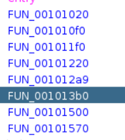
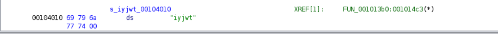
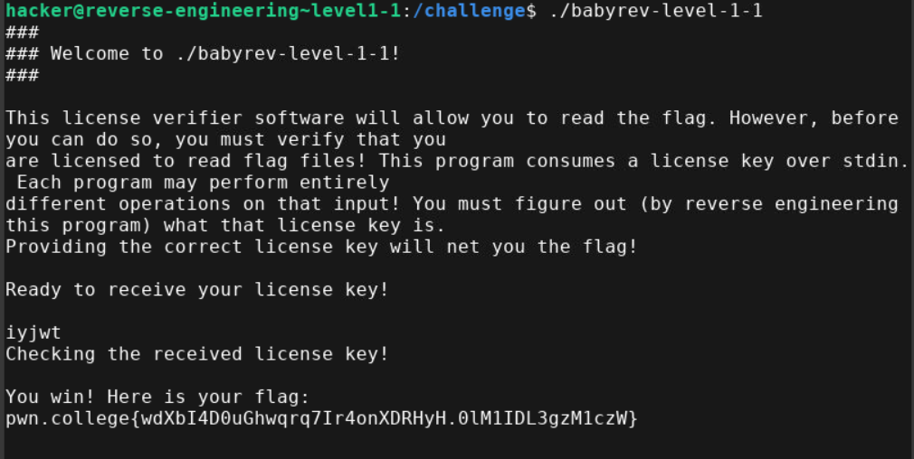

- I used ghidra to anaylyse the binary 
- I Went over all the functions and found this one 

```
void FUN_001013b0(undefined8 param_1,undefined8 *param_2)

{
  int iVar1;
  long in_FS_OFFSET;
  undefined4 local_16;
  undefined2 local_12;
  undefined8 local_10;
  
  local_10 = *(undefined8 *)(in_FS_OFFSET + 0x28);
  setvbuf(stdin,(char *)0x0,2,0);
  setvbuf(stdout,(char *)0x0,2,0);
  puts("###");
  printf("### Welcome to %s!\n",*param_2);
  puts("###");
  putchar(10);
  puts(
      "This license verifier software will allow you to read the flag. However, before you can do so , you must verify that you"
      );
  puts(
      "are licensed to read flag files! This program consumes a license key over stdin. Each program  may perform entirely"
      );
  puts(
      "different operations on that input! You must figure out (by reverse engineering this program)  what that license key is."
      );
  puts("Providing the correct license key will net you the flag!\n");
  local_16 = 0;
  local_12 = 0;
  puts("Ready to receive your license key!\n");
  read(0,&local_16,5);
  puts("Checking the received license key!\n");
  iVar1 = memcmp(&local_16,s_iyjwt_00104010,5);
  if (iVar1 == 0) {
    FUN_001012a9();
                    /* WARNING: Subroutine does not return */
    exit(0);
  }
  puts("Wrong! No flag for you!");
                    /* WARNING: Subroutine does not return */
  exit(1);
}

```
- Here `memcmp` is used to compare the user input `local_16` and the value at `s_iyjwt_00104010` memory location
- 
- The key is `iyjwt`

- Flag: pwn.college{wdXbI4D0uGhwqrq7Ir4onXDRHyH.0lM1IDL3gzM1czW}
