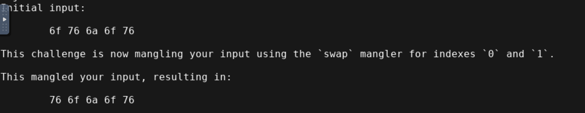
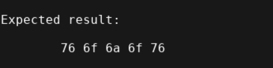
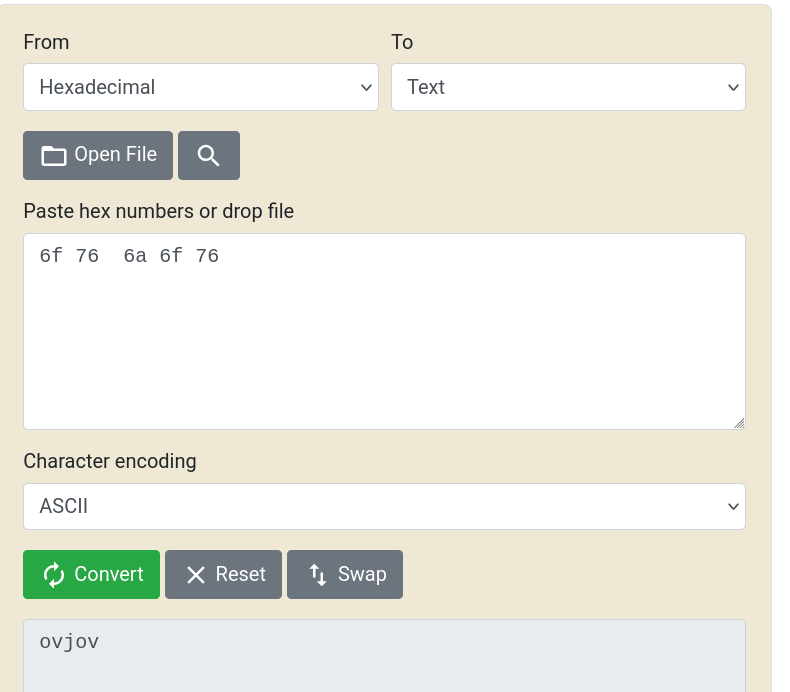
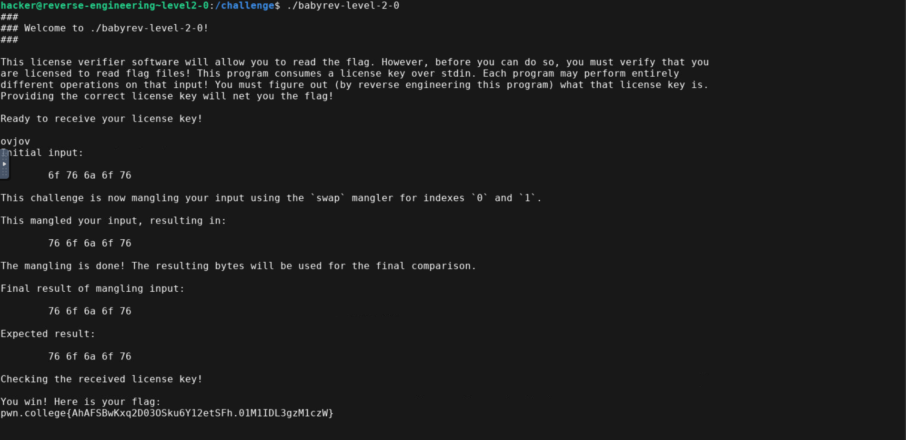

- Here the input string is converted to hex and the first two alphabets are swapped

- The swapped(mangled) input is compared with expected result
- So if we swap the first two alphabets of expected result and convert it to ascii we get the key

