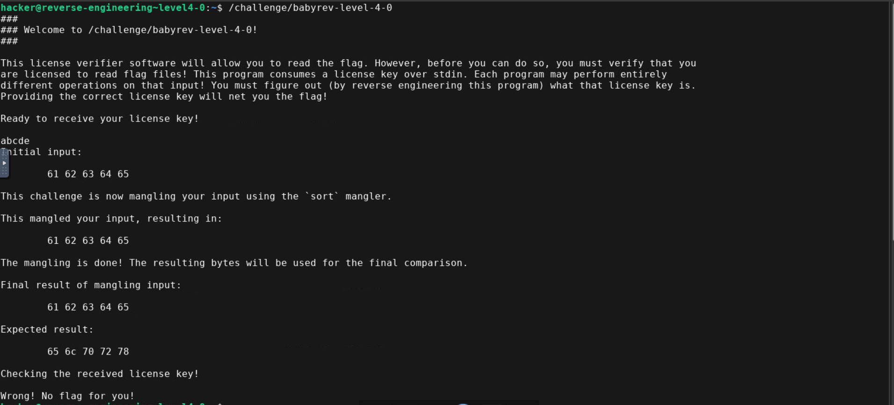
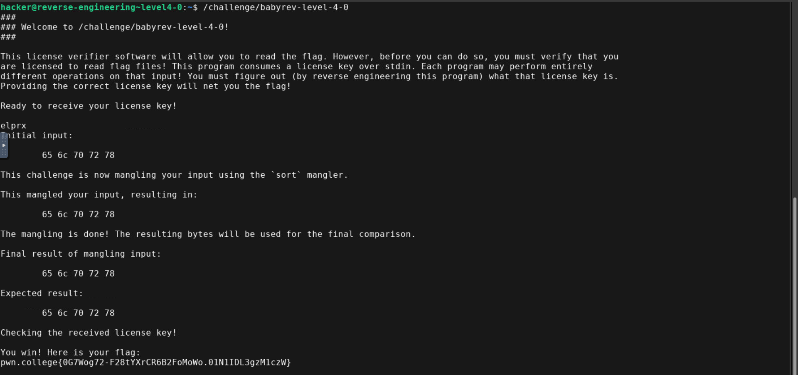

- Test input

- Here user input is sorted in ascending order
- The expected result is already sorted in ascending order so we can just any input as long as it contains the same characters as the expected result and get the flag

- Flag: pwn.college{0G7Wog72-F28tYXrCR6B2FoMoWo.01N1IDL3gzM1czW}
