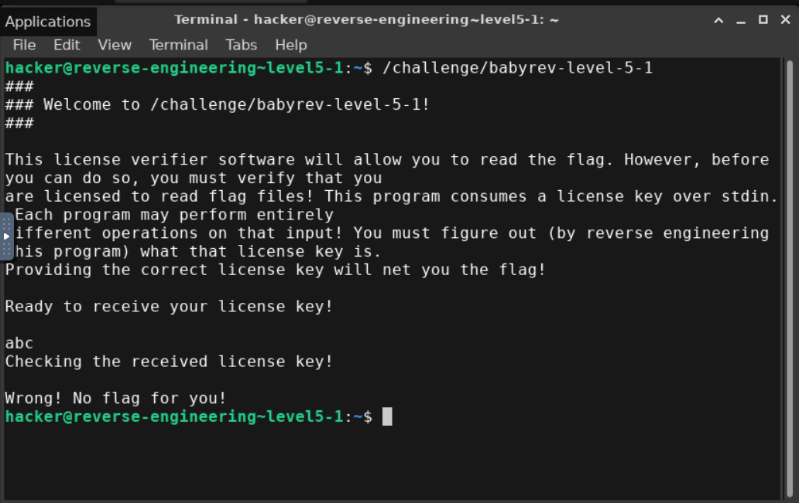
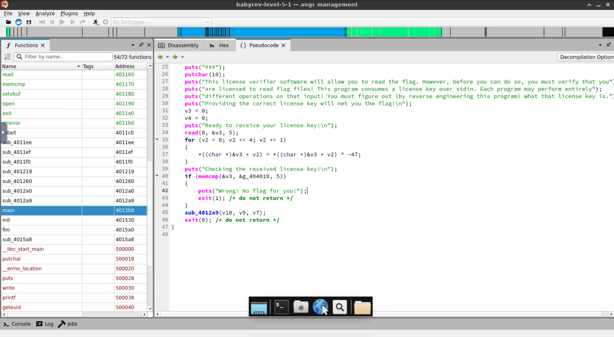
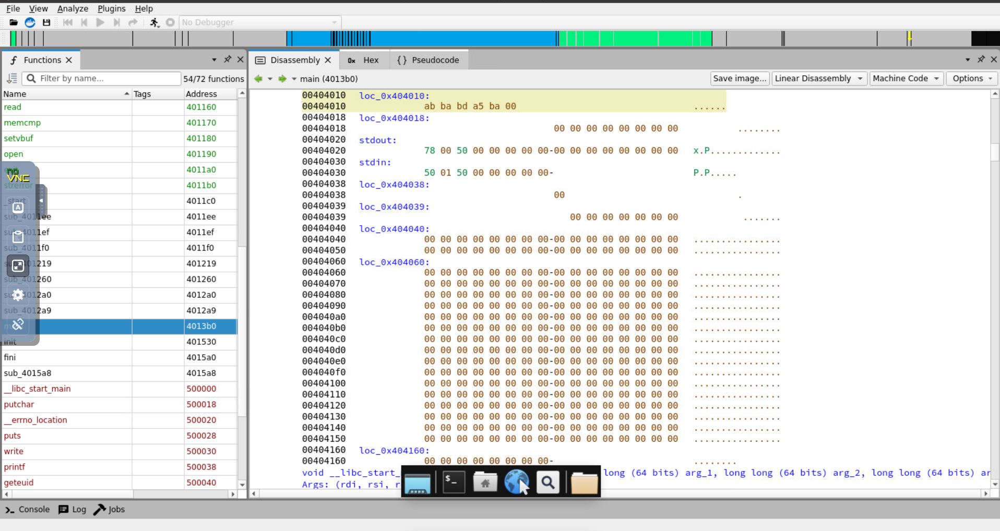
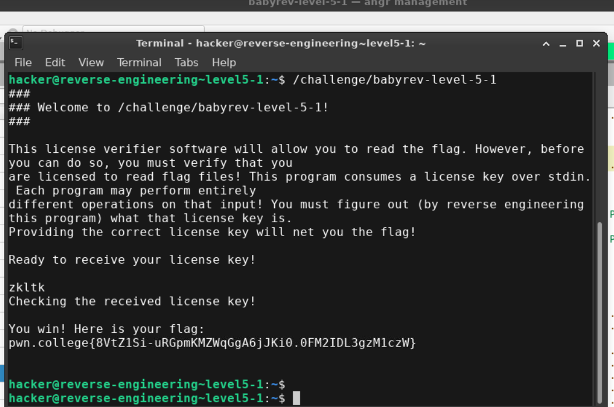

- Test input

- After analysing psuedocode

- The program XOR's the user input(5 bytes) with -47 and then compares the result with string stored at `g_404010`

- Taking XOR of the value at `g_404010` and -47 we get "zkltk*unprintable*"
- Since the 6th character is unprintable we take the first 5 as key, "zkltk"

- Flag is pwn.college{8VtZ1Si-uRGpmKMZWqGgA6jJKi0.0FM2IDL3gzM1czW}
