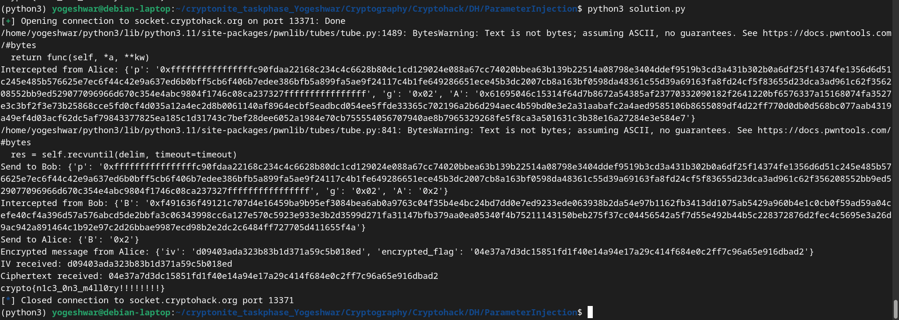

- Some watching:
    - [ Secret Key Exchange (Diffie-Hellman) - Computerphile ](https://youtu.be/NmM9HA2MQGI)
    - [ Diffie Hellman -the Mathematics bit- Computerphile ](https://youtu.be/Yjrfm_oRO0w)
    - [ Key Exchange Problems - Computerphile ](https://youtu.be/vsXMMT2CqqE)
    - [ 7 - Cryptography Basics - Diffie-Hellman Key Exchange ](https://youtu.be/d1KXDGgwIpA?si=whN9Fm1lkacvpMka)

- Normal server traffic
    - Alice -> Bob
        Send "p", "g", "A=g^a%p"
    - Bob -> Alice
        Send "B=g^b%p"
    - Alice generates her secret key B^a%p
    - Bob generates his secret key A^b%p
    - Alice sends iv and cipher text to Bob
- Flag is encrypted using AES (Advanced Encryption Standard) in CBC (Cipher Block Chaining) mode

- Implementing man in the middle after analysing server traffic
    - Alice -> Man

        Send "p", "g", "A=g^a%p"  
    - Man -> Bob

        Send "p", "g", "S=g^s%p" where "s=1"
    - Bob -> Man

        Send "B=g^b%p"
    - Man -> Alice

        Send "S=g^s%p"
    - Now Alice generates secret key (g^s%p)^a%p
    - Now Bob generates secret key (g^s%p)^b%p
    - Now Man generates secret key (g^a%p)^s%p which is the same as A's key
    - Now Man generates secret key (g^b%p)^s%p which is the same as B's key
    - Alice sends iv and cipher text to Bob which is intercepted by man

- Now since Man has the access to secret key he can decrypt any message sent by Alice to Bob or Bob to Alice
- Python code to do the same: 
```
from pwn import remote
import json
from Crypto.Cipher import AES
from Crypto.Util.Padding import pad, unpad
import hashlib

# Connect to the server
HOST = 'socket.cryptohack.org'
PORT = 13371
conn = remote(HOST, PORT)

# Function to receive JSON data
def recv_json():
    line = conn.recvline()
    return json.loads(line.decode())

# Function to send JSON data after waiting for the prompt
def send_json(data):
    request = json.dumps(data).encode()
    conn.sendlineafter(": ", request)

# Intercept message from Alice
conn.readuntil(": ")  # Read until the prompt ": "
alice_message = recv_json()
print("Intercepted from Alice:", alice_message)

# Keep g and p as received, modify s to 1 (MITM's secret value)
s = 1  # Man's secret value
g = int(alice_message['g'], 16)  # g as received
p = int(alice_message['p'], 16)  # p as received
A = int(alice_message['A'], 16)  # Alice's public value A

# Man computes S = g^s % p
S = pow(g, s, p)  # g^s % p where s = 1

# MITM sends S to Bob instead of A
alice_message['A'] = hex(S)  # Man sends S instead of A to Alice
send_json(alice_message)
print("Send to Bob:", alice_message)

# Receive message from Bob
conn.readuntil(": ")  # Read until the prompt ": "
bob_message = recv_json()
print("Intercepted from Bob:", bob_message)

# MITM sends S to Alice instead of B
bob_message['B'] = hex(S)  # Man sends S instead of B to Alice
send_json(bob_message)
print("Send to Alice:", bob_message)

# Receive encrypted flag from Alice
conn.readuntil(": ")  # Read until the prompt ": "
encrypted_message = recv_json()
print("Encrypted message from Alice:", encrypted_message)

# Extract iv and ciphertext from the encrypted message
iv = encrypted_message['iv']
ciphertext = encrypted_message['encrypted_flag']

print("IV received:", iv)
print("Ciphertext received:", ciphertext)

shared_secret=pow(A,s,p) # Using shared secret between Alice and Man since the message is sent by Alice

# Now that Man knows both shared secrets, he can decrypt any message sent between Alice and Bob.
def is_pkcs7_padded(message):
    padding = message[-message[-1]:]
    return all(padding[i] == len(padding) for i in range(0, len(padding)))


def decrypt_flag(shared_secret: int, iv: str, ciphertext: str):
    # Derive AES key from shared secret
    sha1 = hashlib.sha1()
    sha1.update(str(shared_secret).encode('ascii'))
    key = sha1.digest()[:16]
    # Decrypt flag
    ciphertext = bytes.fromhex(ciphertext)
    iv = bytes.fromhex(iv)
    cipher = AES.new(key, AES.MODE_CBC, iv)
    plaintext = cipher.decrypt(ciphertext)

    if is_pkcs7_padded(plaintext):
        return unpad(plaintext, 16).decode('ascii')
    else:
        return plaintext.decode('ascii')


print(decrypt_flag(shared_secret, iv, ciphertext))

# Close the connection
conn.close()

```


- In the Code:
    - AES Key Derivation: The shared secret (computed via Diffie-Hellman) is used to generate the AES key. The shared secret is hashed using SHA-1, and the first 16 bytes of the hash are used as the AES key.
    - Decryption Process: The ciphertext (from the encrypted flag) is decrypted using the derived AES key and the provided IV in CBC mode.
- Flag is crypto{n1c3_0n3_m4ll0ry!!!!!!!!}