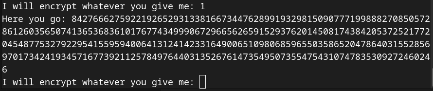
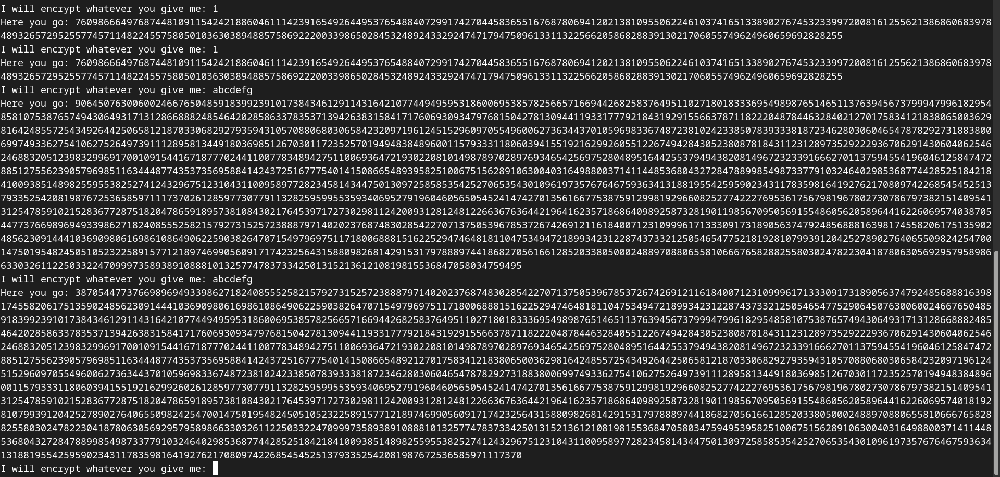
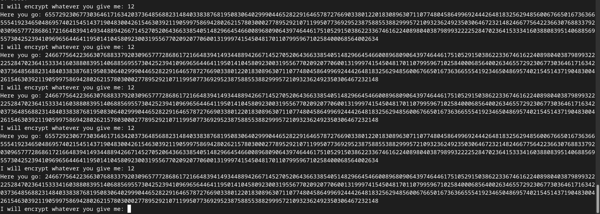
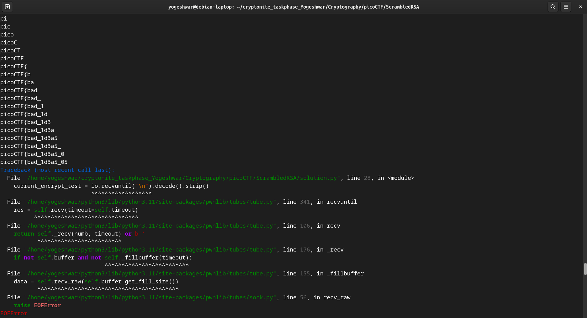

- After connecting to the server using netcat we are presented with a 
    - flag
    - n
    - e
    - A prompt "I will encrypt whatever you give me:"

- The challenge description says "Hmmm I wonder if you have learned your lesson... Let's see if you understand RSA and how the encryption works." If this is normal RSA encryption, encrypting `1` should give us `1` but thats not the case.

- It gives the same encryption if we try `1` multiple times but if we try a larger string like `abcdefg` multiple times it gives us different output. That should not be the case with normal RSA.

- The `flag` is much larger than `n` which is weird.
- `12` has only two characters and there are only two distinct cipher texts in the output

- This suggests that number of different cipher texts is equal to the number of characters in the string
- `1` has only one character so only one distinct cipher exists
- Trying `abc` multiple times confirms this
- After trying several different inputs, main conclusions:
    - Each character has different representing value based on indice.
    - Number of different cipher texts is equal to the number of characters in the string (all are scrambled but made up of same parts)
    - 
- We know that flag starts with `picoCTF{`, so if we find the cipher text of `pi` and remove cipher of `p` we get `i`'s cipher at 1st indice
- Then we find the cipher of `pic` and remove cipher of `p` and `i` we got from previous step and we get the cipher of `c`
- Repeating this untill we reach `{`
- After that we loop through every ascii character and see if the cipher text of `that` character at `that` index is present in the cipher of `flag`, if it is then we found the correct character for that position
- Repeating untill we reach `}`
- Flag!
- (Its hard t put this into words)
- Writing python script for the same
- The connection keeps closing
 
- FLag:

