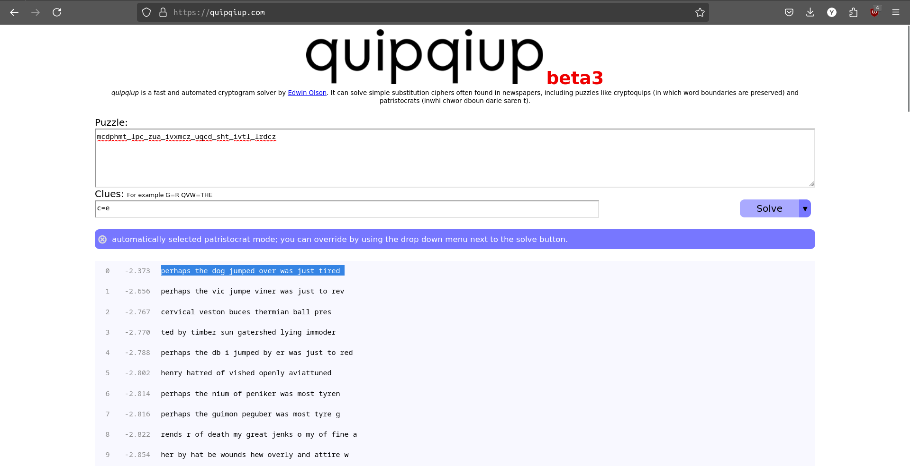

- The code first identifies all the `.txt` in current directory and its subdirectories
```
files = [
    os.path.join(path, file)
    for path, dirs, files in os.walk('.')
    for file in files
    if file.split('.')[-1] == 'txt'
]
```
- Creates a mono alphabetic substitution cipher
```
alphabet = list('abcdefghijklmnopqrstuvwxyz')
random.shuffle(shuffled := alphabet[:])
dictionary = dict(zip(alphabet, shuffled))
``` 
- Reads the contents of each `.txt` file, and encrypts it by substituing letters using the generated cipher  
```
for filename in files:
    text = open(filename, 'r').read()
    encrypted = ''.join([
        dictionary[c]
        if c in dictionary else c
        for c in text
    ])
    open(filename, 'w').write(encrypted)
```
- Encrypted flag: mcdphmt_lpc_zua_ivxmcz_uqcd_sht_ivtl_lrdcz
- `c` is the most repeated letter in the encrypted flag
- `e` is the most used letter in english language so we give the [tool](https://quipqiup.com/) a clue c=e
- 
- "perhaps the dog jumped over was just tired" makes the most sense here 
-  picoCTF{perhaps_the_dog_jumped_over_was_just_tired} is the flag