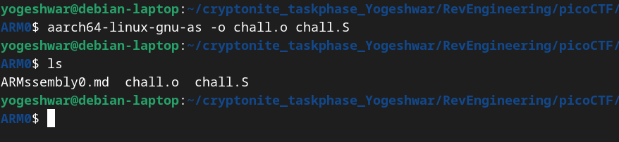
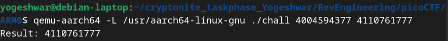
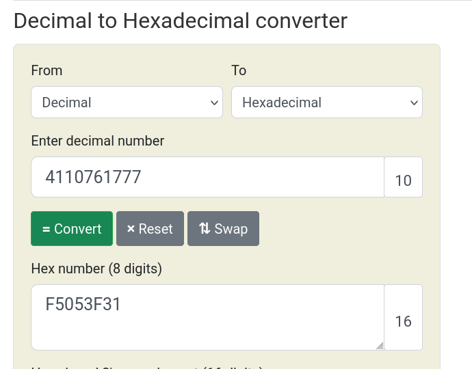

# ARMssembly0

- The file `chall.S` has the following contents
```
	.arch armv8-a
	.file	"chall.c"
	.text
	.align	2
	.global	func1
	.type	func1, %function
func1:
	sub	sp, sp, #16
	str	w0, [sp, 12]
	str	w1, [sp, 8]
	ldr	w1, [sp, 12]
	ldr	w0, [sp, 8]
	cmp	w1, w0
	bls	.L2
	ldr	w0, [sp, 12]
	b	.L3
.L2:
	ldr	w0, [sp, 8]
.L3:
	add	sp, sp, 16
	ret
	.size	func1, .-func1
	.section	.rodata
	.align	3
.LC0:
	.string	"Result: %ld\n"
	.text
	.align	2
	.global	main
	.type	main, %function
main:
	stp	x29, x30, [sp, -48]!
	add	x29, sp, 0
	str	x19, [sp, 16]
	str	w0, [x29, 44]
	str	x1, [x29, 32]
	ldr	x0, [x29, 32]
	add	x0, x0, 8
	ldr	x0, [x0]
	bl	atoi
	mov	w19, w0
	ldr	x0, [x29, 32]
	add	x0, x0, 16
	ldr	x0, [x0]
	bl	atoi
	mov	w1, w0
	mov	w0, w19
	bl	func1
	mov	w1, w0
	adrp	x0, .LC0
	add	x0, x0, :lo12:.LC0
	bl	printf
	mov	w0, 0
	ldr	x19, [sp, 16]
	ldp	x29, x30, [sp], 48
	ret
	.size	main, .-main
	.ident	"GCC: (Ubuntu/Linaro 7.5.0-3ubuntu1~18.04) 7.5.0"
	.section	.note.GNU-stack,"",@progbits

```
- `.arch armv8-a` This tells us the the target architecture is armv8-a
- Using the `aarch64-linux-gnu-as` assembler to assemble the `chall.S` file into an object file `chall.o`

- Using `aarch64-linux-gnu-gcc` cross compiler to link the object file with standard C library (libc) for `printf` and `atoi` 

- Since my system is not ARM-based I used QEMU to emulate ARM64 architecture and run the `chall` file with required arguments (give in challenge description)

- `-L /usr/aarch64-linux-gnu` tells the path where QEMU can find the ARM64 libraries 
- converting result to hex

- Flag: picoCTF{F5053F31}
 