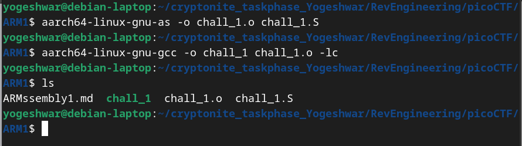
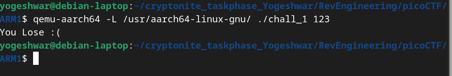
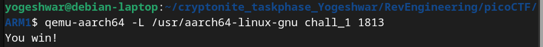
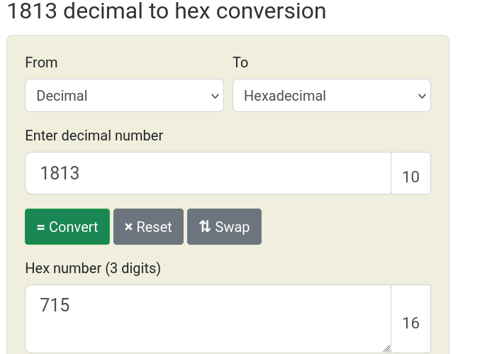

# ARMssembly1
- The file `chall_1.S` has the following contents
```
	.arch armv8-a
	.file	"chall_1.c"
	.text
	.align	2
	.global	func
	.type	func, %function
func:
	sub	sp, sp, #32
	str	w0, [sp, 12]
	mov	w0, 85
	str	w0, [sp, 16]
	mov	w0, 6
	str	w0, [sp, 20]
	mov	w0, 3
	str	w0, [sp, 24]
	ldr	w0, [sp, 20]
	ldr	w1, [sp, 16]
	lsl	w0, w1, w0
	str	w0, [sp, 28]
	ldr	w1, [sp, 28]
	ldr	w0, [sp, 24]
	sdiv	w0, w1, w0
	str	w0, [sp, 28]
	ldr	w1, [sp, 28]
	ldr	w0, [sp, 12]
	sub	w0, w1, w0
	str	w0, [sp, 28]
	ldr	w0, [sp, 28]
	add	sp, sp, 32
	ret
	.size	func, .-func
	.section	.rodata
	.align	3
.LC0:
	.string	"You win!"
	.align	3
.LC1:
	.string	"You Lose :("
	.text
	.align	2
	.global	main
	.type	main, %function
main:
	stp	x29, x30, [sp, -48]!
	add	x29, sp, 0
	str	w0, [x29, 28]
	str	x1, [x29, 16]
	ldr	x0, [x29, 16]
	add	x0, x0, 8
	ldr	x0, [x0]
	bl	atoi
	str	w0, [x29, 44]
	ldr	w0, [x29, 44]
	bl	func
	cmp	w0, 0
	bne	.L4
	adrp	x0, .LC0
	add	x0, x0, :lo12:.LC0
	bl	puts
	b	.L6
.L4:
	adrp	x0, .LC1
	add	x0, x0, :lo12:.LC1
	bl	puts
.L6:
	nop
	ldp	x29, x30, [sp], 48
	ret
	.size	main, .-main
	.ident	"GCC: (Ubuntu/Linaro 7.5.0-3ubuntu1~18.04) 7.5.0"
	.section	.note.GNU-stack,"",@progbits

```
- Creating an executable 

  
- Running with random argument

  
- Analysing `chal_1.S`

```
func:
	sub	sp, sp, #32 	// create space for local variables
	str	w0, [sp, 12] 	// (user input) stored at sp+12
	mov	w0, 85 			// 85 moved to w0
	str	w0, [sp, 16]	// 85 stored at sp+16
	mov	w0, 6			// 6 moved to w0
	str	w0, [sp, 20]	// 6 stored at sp+20
	mov	w0, 3			// 3 moved to w0
	str	w0, [sp, 24] 	// 3 stored at sp+24
	ldr	w0, [sp, 20]	// 6 -> w0
	ldr	w1, [sp, 16]	// 85 -> w1
	lsl	w0, w1, w0		// 85 * 2^6 -> w0 
	str	w0, [sp, 28]	// 5440 -> sp+28
	ldr	w1, [sp, 28]	// 5440 ->w1
	ldr	w0, [sp, 24]	// 3 -> w0
	sdiv	w0, w1, w0	// 5440/3 -> w0
	str	w0, [sp, 28]	// 1813 -> sp+28
	ldr	w1, [sp, 28]	// 1813 -> w1
	ldr	w0, [sp, 12]	// user input -> w0
	sub	w0, w1, w0		// 1813 - w0 -> w0  
	str	w0, [sp, 28]	// w0 -> sp +28
	ldr	w0, [sp, 28]	// sp + 28 -> w0
	add	sp, sp, 32		// deallocates space
	ret					// returns w0 which is equal to 1813 - user input
	.size	func, .-func
	.section	.rodata
	.align	3
```
```
main:
	stp	x29, x30, [sp, -48]!
	add	x29, sp, 0
	str	w0, [x29, 28]
	str	x1, [x29, 16]
	ldr	x0, [x29, 16]
	add	x0, x0, 8
	ldr	x0, [x0]
	bl	atoi
	str	w0, [x29, 44]
	ldr	w0, [x29, 44]
	bl	func
	cmp	w0, 0
	bne	.L4
	adrp	x0, .LC0
	add	x0, x0, :lo12:.LC0
	bl	puts
	b	.L6	
```

- main calls func with user input
- if the returned value (w0) is equal to 0 then prints "You win!"
- if the returned value (w0) is not equal to 0 then prints "You lose!"

For the function to print "You win" with variables 85, 6 and 3, user input should be 1813.

(w0 is a 32-bit register typically used to pass an argument to a function and to hold the return value from a function)



- Converting to 1813 to hex



- Flag is picoCTF{00000715}


 
