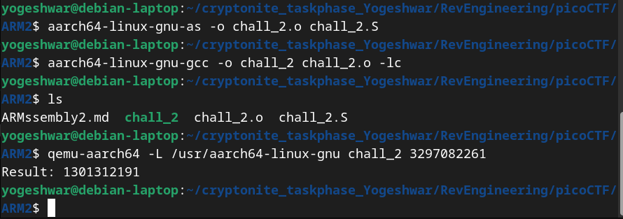

# ARMssembly2
- `chall_2.S`
```
	.arch armv8-a
	.file	"chall_2.c"
	.text
	.align	2
	.global	func1
	.type	func1, %function
func1:
	sub	sp, sp, #32
	str	w0, [sp, 12]
	str	wzr, [sp, 24]
	str	wzr, [sp, 28]
	b	.L2
.L3:
	ldr	w0, [sp, 24]
	add	w0, w0, 3
	str	w0, [sp, 24]
	ldr	w0, [sp, 28]
	add	w0, w0, 1
	str	w0, [sp, 28]
.L2:
	ldr	w1, [sp, 28]
	ldr	w0, [sp, 12]
	cmp	w1, w0
	bcc	.L3
	ldr	w0, [sp, 24]
	add	sp, sp, 32
	ret
	.size	func1, .-func1
	.section	.rodata
	.align	3
.LC0:
	.string	"Result: %ld\n"
	.text
	.align	2
	.global	main
	.type	main, %function
main:
	stp	x29, x30, [sp, -48]!
	add	x29, sp, 0
	str	w0, [x29, 28]
	str	x1, [x29, 16]
	ldr	x0, [x29, 16]
	add	x0, x0, 8
	ldr	x0, [x0]
	bl	atoi
	bl	func1
	str	w0, [x29, 44]
	adrp	x0, .LC0
	add	x0, x0, :lo12:.LC0
	ldr	w1, [x29, 44]
	bl	printf
	nop
	ldp	x29, x30, [sp], 48
	ret
	.size	main, .-main
	.ident	"GCC: (Ubuntu/Linaro 7.5.0-3ubuntu1~18.04) 7.5.0"
	.section	.note.GNU-stack,"",@progbits

```
- The `main` converts the user input to integer and passes it to `func1` 
- The `func` effectively multiples the user input bt 3 and returns the value
- But 3297082261 * 3 is not equal to 1301312191
- This is because the size of w0 register is 32 bits and the result which we are attempting to store is larger than 32 bits (3297082261 * 3 = 9891246783 is 34 bits) -> overflow occurs and it wraps around to 13013121


- Running the code with required argument

- Converting 1301312191 to hex we get 4D9072BF
- Flag is picoCTF{4D9072BF}