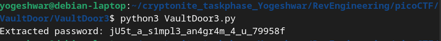

```
    public boolean checkPassword(String password) {
        if (password.length() != 32) {
            return false;
        }
        char[] buffer = new char[32];
        int i;
        for (i=0; i<8; i++) {
            buffer[i] = password.charAt(i);
        }
        for (; i<16; i++) {
            buffer[i] = password.charAt(23-i);
        }
        for (; i<32; i+=2) {
            buffer[i] = password.charAt(46-i);
        }
        for (i=31; i>=17; i-=2) {
            buffer[i] = password.charAt(i);
        }
        String s = new String(buffer);
        return s.equals("jU5t_a_sna_3lpm18g947_u_4_m9r54f");
    }
```
- Here we need to reverse engineer password such that buffer is equal to the string "jU5t_a_sna_3lpm18g947_u_4_m9r54f"
- `VaultDoor3.py` python code to extract the password
```
def extract_password():
    target = "jU5t_a_sna_3lpm18g947_u_4_m9r54f"
    password = [''] * 32  # Create a list of 32 empty slots for the password

    # Step 1: Fill the first 8 characters directly from the target string
    for i in range(8):
        password[i] = target[i]

    # Step 2: Fill the next 8 characters (indices 8 to 15) using reverse of the original password
    for i in range(8, 16):
        password[i] = target[23 - i]

    # Step 3: Fill the next 16 characters (indices 16 to 31) by taking every other character
    for i in range(16, 32, 2):
        password[i] = target[46 - i]

    # Step 4: Fill the remaining odd indices (17 to 31) directly from the password
    for i in range(31, 16, -2):
        password[i] = target[i]

    # Combine the list into a string and return the password
    return ''.join(password)


# Extract the password
password = extract_password()
print("Extracted password:", password)

```


- Flag is picoCTF{jU5t_a_s1mpl3_an4gr4m_4_u_79958f}