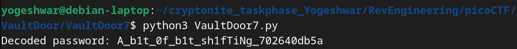

```
 public int[] passwordToIntArray(String hex) {
        int[] x = new int[8];
        byte[] hexBytes = hex.getBytes();
        for (int i=0; i<8; i++) {
            x[i] = hexBytes[i*4]   << 24
                 | hexBytes[i*4+1] << 16
                 | hexBytes[i*4+2] << 8
                 | hexBytes[i*4+3];
        }
        return x;
    }

    public boolean checkPassword(String password) {
        if (password.length() != 32) {
            return false;
        }
        int[] x = passwordToIntArray(password);
        return x[0] == 1096770097
            && x[1] == 1952395366
            && x[2] == 1600270708
            && x[3] == 1601398833
            && x[4] == 1716808014
            && x[5] == 1734293296
            && x[6] == 842413104
            && x[7] == 1684157793;
    }
```
- Here the password is first converted to `passwordBytesArray` then to `passwordIntArray` using the `passwordtoIntArray()` method
- If we can convert the given integer array `x[]` to byte array and then convert resulting array to character array we should be able 
to derive the password.
`VaultDoor7.py`
```
def int_to_hex_string(int_values):
    password_bytes = []
    for value in int_values:
        # Break the 32-bit integer into 4 bytes
        password_bytes.extend([
            (value >> 24) & 0xFF,
            (value >> 16) & 0xFF,
            (value >> 8) & 0xFF,
            value & 0xFF
        ])
    # Convert bytes to ASCII characters
    password = ''.join(chr(byte) for byte in password_bytes)
    return password

# Predefined integers
predefined = [
    1096770097, 1952395366, 1600270708, 1601398833,
    1716808014, 1734293296, 842413104, 1684157793
]

# Find the password
password = int_to_hex_string(predefined)
print(f"Decoded password: {password}")

```

- The flag is picoCTF{A_b1t_0f_b1t_sh1fTiNg_702640db5a}