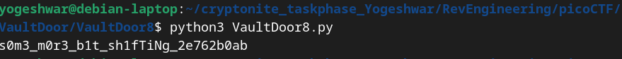

```
public char[] scramble(String password) {
        char[] a = password.toCharArray();
        for (int b = 0; b < a.length; b++) {
            char c = a[b];
            c = switchBits(c, 1, 2);
            c = switchBits(c, 0, 3);
            c = switchBits(c, 5, 6);
            c = switchBits(c, 4, 7);
            c = switchBits(c, 0, 1);
            c = switchBits(c, 3, 4);
            c = switchBits(c, 2, 5);
            c = switchBits(c, 6, 7);
            a[b] = c;
        }
        return a;
    }

    public char switchBits(char c, int p1, int p2) {
        char mask1 = (char) (1 << p1);
        char mask2 = (char) (1 << p2);
        char bit1 = (char) (c & mask1);
        char bit2 = (char) (c & mask2);
        char rest = (char) (c & ~(mask1 | mask2));
        char shift = (char) (p2 - p1);
        char result = (char) ((bit1 << shift) | (bit2 >> shift) | rest);
        return result;
    }

    public boolean checkPassword(String password) {
        char[] scrambled = scramble(password);
        char[] expected = {
                0xF4, 0xC0, 0x97, 0xF0, 0x77, 0x97, 0xC0, 0xE4, 0xF0, 0x77, 0xA4, 0xD0, 0xC5, 0x77, 0xF4, 0x86, 0xD0,
                0xA5, 0x45, 0x96, 0x27, 0xB5, 0x77, 0xE0, 0x95, 0xF1, 0xE1, 0xE0, 0xA4, 0xC0, 0x94, 0xA4 };
        return Arrays.equals(scrambled, expected);
    }
```
- switchBits() swaps the bits at positions p1 and p2 for a given character. To reverse the operation, we can apply switchBits() with the same positions (p1 and p2) because bit swapping is its own inverse
- Since the scrambling applies a sequence of switchBits calls, reversing it will "unscramble" the password.
- The expected array contains the scrambled password. By reversing the scramble process, we can derive the original password.
- `VaultDoor8.py` to unscramble
```
def switch_bits(c, p1, p2):

    mask1 = 1 << p1
    mask2 = 1 << p2
    bit1 = c & mask1
    bit2 = c & mask2
    rest = c & ~(mask1 | mask2)
    shift = p2 - p1
    result = (bit1 << shift) | (bit2 >> shift) | rest
    return result

def main():
    expected = [
        0xF4, 0xC0, 0x97, 0xF0, 0x77, 0x97, 0xC0, 0xE4, 0xF0, 0x77, 0xA4, 0xD0, 0xC5, 0x77, 0xF4, 0x86, 0xD0,
        0xA5, 0x45, 0x96, 0x27, 0xB5, 0x77, 0xE0, 0x95, 0xF1, 0xE1, 0xE0, 0xA4, 0xC0, 0x94, 0xA4
    ]
    
    for b in range(len(expected)):
        c = expected[b]
        c = switch_bits(c, 6, 7)
        c = switch_bits(c, 2, 5)
        c = switch_bits(c, 3, 4)
        c = switch_bits(c, 0, 1)
        c = switch_bits(c, 4, 7)
        c = switch_bits(c, 5, 6)
        c = switch_bits(c, 0, 3)
        c = switch_bits(c, 1, 2)
        expected[b] = c
    
    # Convert the resulting list of integers to a string
    result = ''.join(chr(c) for c in expected)
    print(result)

if __name__ == "__main__":
    main()

```

- The flag is picoCTF{s0m3_m0r3_b1t_sh1fTiNg_2e762b0ab}
