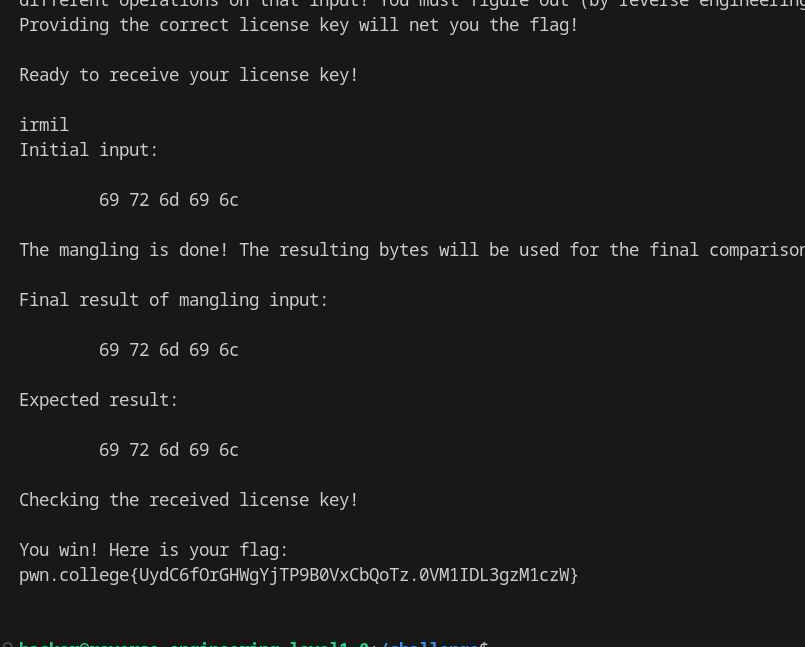

- In this challenge user input is first converted to hex then compared with expected value

- Converting the given expected value back to text we get 

Flag:
pwn.college{UydC6fOrGHWgYjTP9B0VxCbQoTz.0VM1IDL3gzM1czW}