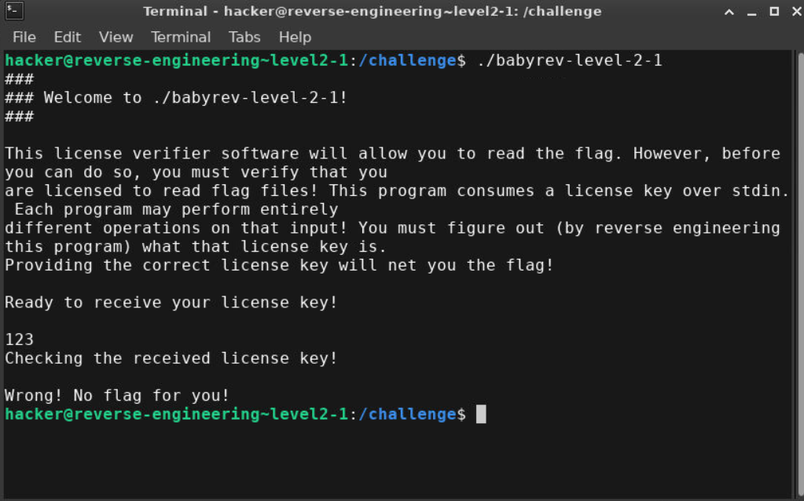
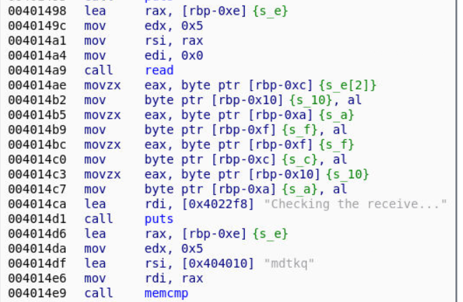
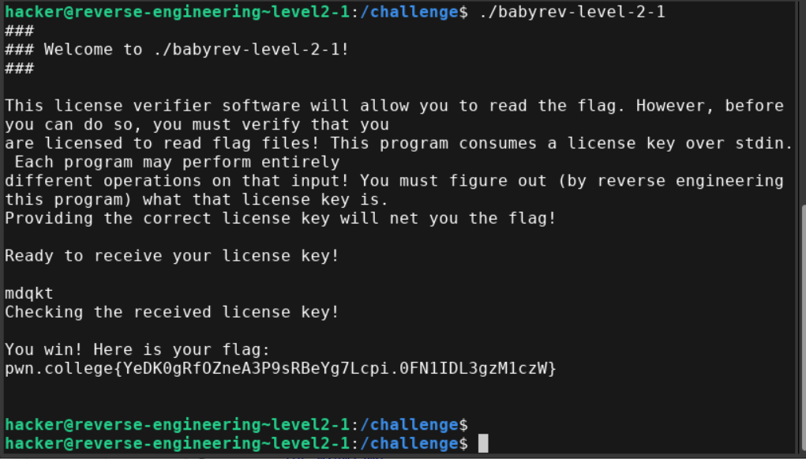

- Test input

- Disassembling the main function using angr-management
```
extern void g_404010;
extern FILE_t *stdin;
extern FILE_t *stdout;

int main(unsigned int a0)
{
    unsigned long long v0;  // [sp-0x30]
    unsigned int v1;  // [sp-0x1c]
    char v2;  // [sp-0x18]
    char v3;  // [sp-0x17]
    unsigned int v4;  // [bp-0x16]
    char v5;  // [sp-0x14]
    char v6;  // [bp-0x12], Other Possible Types: unsigned short
    unsigned long long v7;  // [sp-0x10]
    unsigned long long v9;  // rdx
    unsigned long long *v10;  // fs
    unsigned long long *v11;  // rsi
    unsigned long long v12;  // rdi

    v1 = a0;
    v0 = v9;
    v7 = v10[5];
    setvbuf(stdin, NULL, 2, 0);
    setvbuf(stdout, NULL, 2, 0);
    puts("###");
    printf("### Welcome to %s!\n", *(v11));
    puts("###");
    putchar(10);
    puts("This license verifier software will allow you to read the flag. However, before you can do so, you must verify that you");
    puts("are licensed to read flag files! This program consumes a license key over stdin. Each program may perform entirely");
    puts("different operations on that input! You must figure out (by reverse engineering this program) what that license key is.");
    puts("Providing the correct license key will net you the flag!\n");
    v4 = 0;
    v6 = 0;
    puts("Ready to receive your license key!\n");
    read(0, &v4, 5);
    v2 = v5;
    v3 = v6;
    v5 = v3;
    v6 = v2;
    puts("Checking the received license key!\n");
    if (memcmp(&v4, "mdtkq", 5))
    {
        puts("Wrong! No flag for you!");
        exit(1); /* do not return */
    }
    sub_4012a9(v12, v11, v9);
    exit(0); /* do not return */
}

``` 

- Here user input is read and stored from rbp-0xe to rbp-0xa (5bytes)
- Each byte contains one letter [rbp-0xe]=1,[rbp-0xd]=2,[rbp-0xc]=3,[rbp-0xb]=4,[rbp-0xa]=5
- Then the data is moved using `mov (move)` and `movzx (move extend zero)`
- On following the sequence:
  Effectively the third and last bytes of the user input are swapped  
- So if the user input is "12345", the mangled input is "12543"
- Then the mangled input is compared against "mdtkq", if it is equal we get the flag
- They key has to be such that on swapping it becomes mdtkq
- "mdqkt" is the key 

- Flag: pwn.college{YeDK0gRfOZneA3P9sRBeYg7Lcpi.0FN1IDL3gzM1czW}
