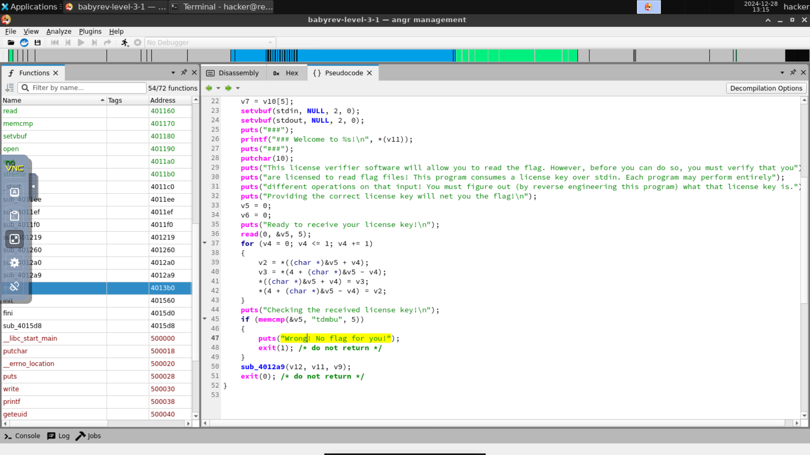
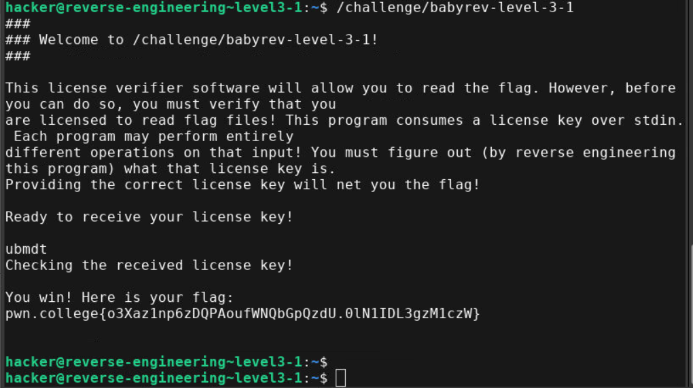

- Test input

- Disassembling main into psuedocode 

- Here the user input(5 bytes) goes through byte level reversal (1st and 5th bytes are swapped, 2nd and 4th bytes are swapped) => user input is reversed
- It is then compared "tdmbu"
- Reverse of "tdmbu" which is "ubmdt" is the key

- Flag: pwn.college{o3Xaz1np6zDQPAoufWNQbGpQzdU.0lN1IDL3gzM1czW}