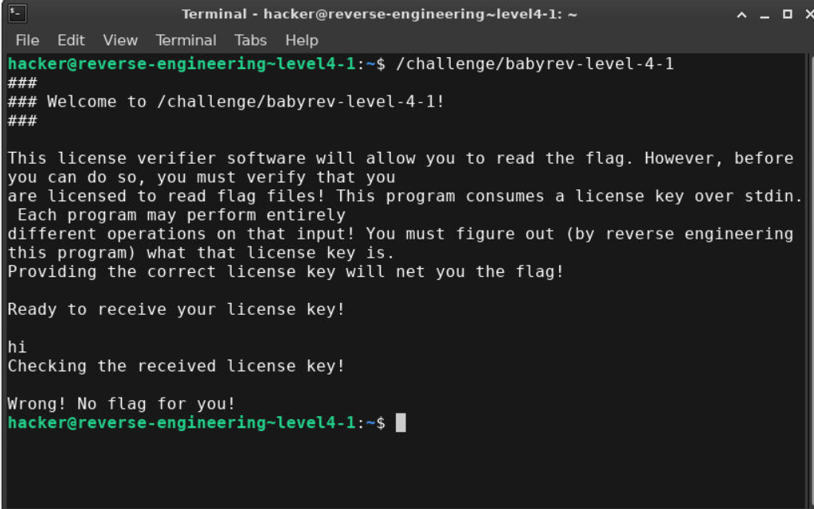
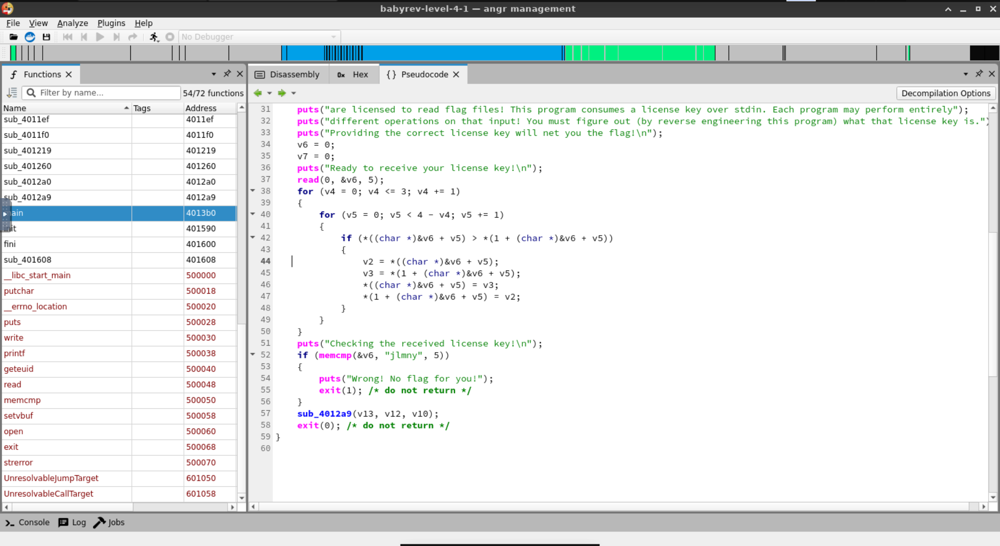
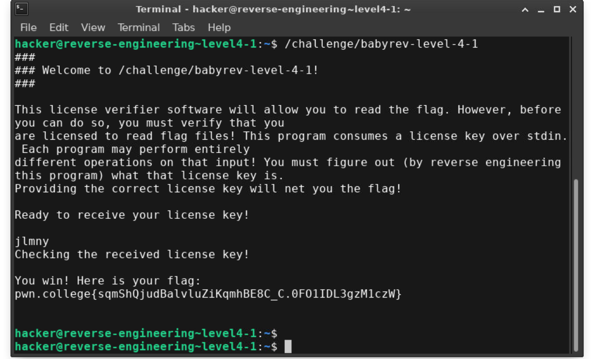

-Test input

- On analysing the psuedcode, we can infer that the program is doing a bubble sort on the first 4 bytes of the user input and leaving the 5th byte untouched
- Mangled input is then compared to "jlmny"
- We need to craft a key such that its first 4 bytes contain all th letters of "jlmn" and 5th byte "y"

- Flag is pwn.college{sqmShQjudBalvluZiKqmhBE8C_C.0FO1IDL3gzM1czW}
