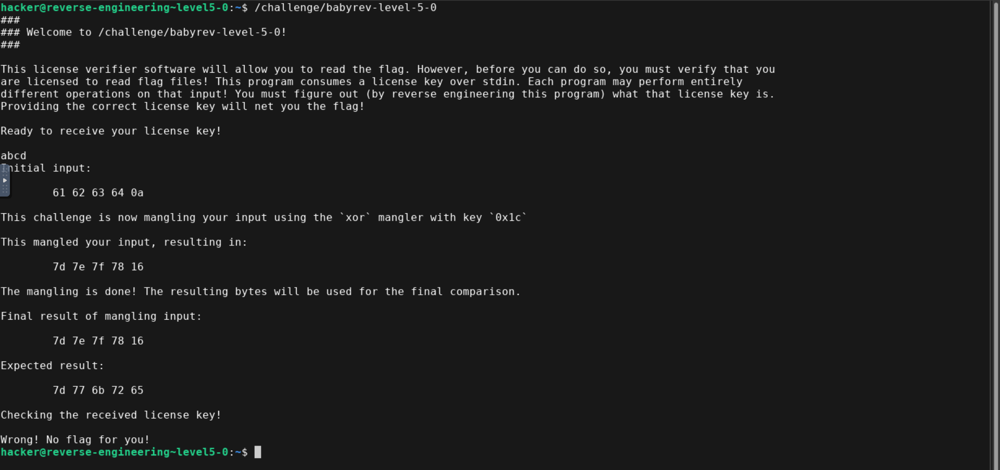
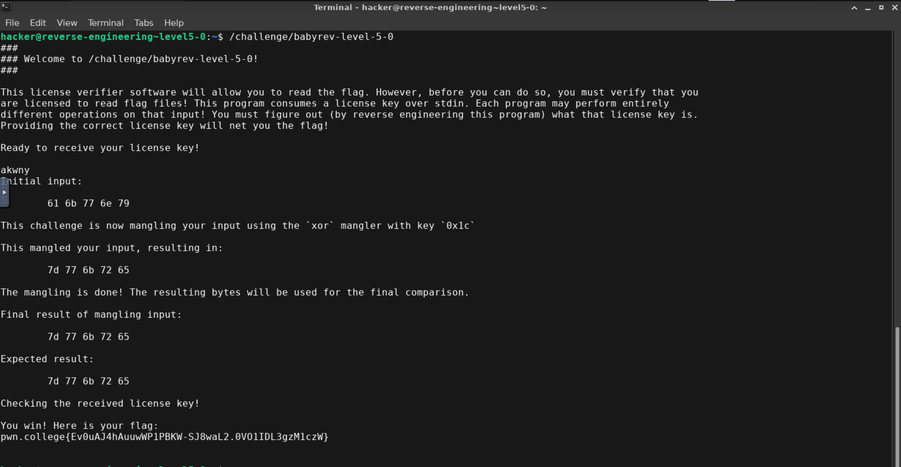

- user input ^ 0x1c should be equal to expected result
- U ^ K = R
- Since XOR is its own inverse, U = R ^ K
- Using online xor calulator
- U="akwny" (after converting hexadecimal to ascii)

- Flag is pwn.college{Ev0uAJ4hAuuwWP1PBKW-SJ8waL2.0VO1IDL3gzM1czW}
