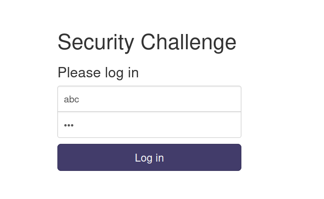
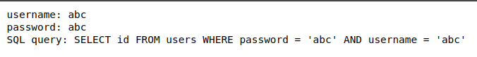
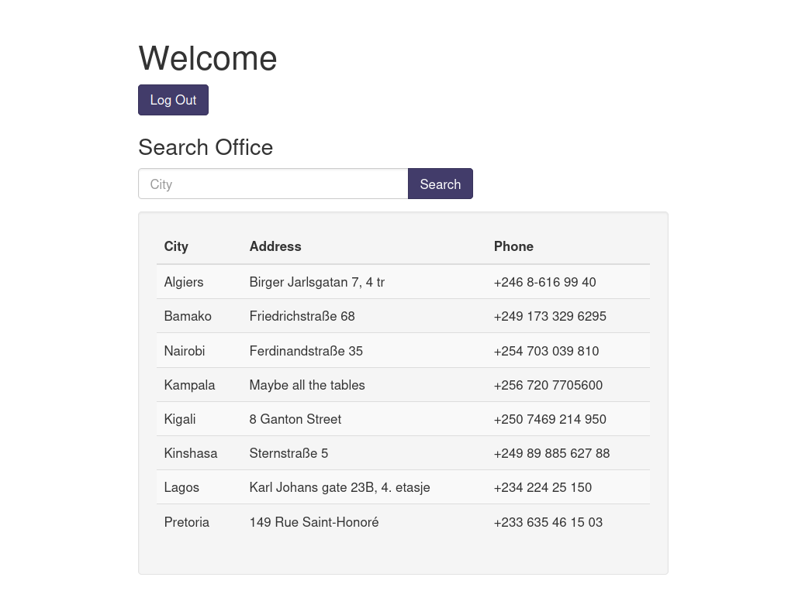
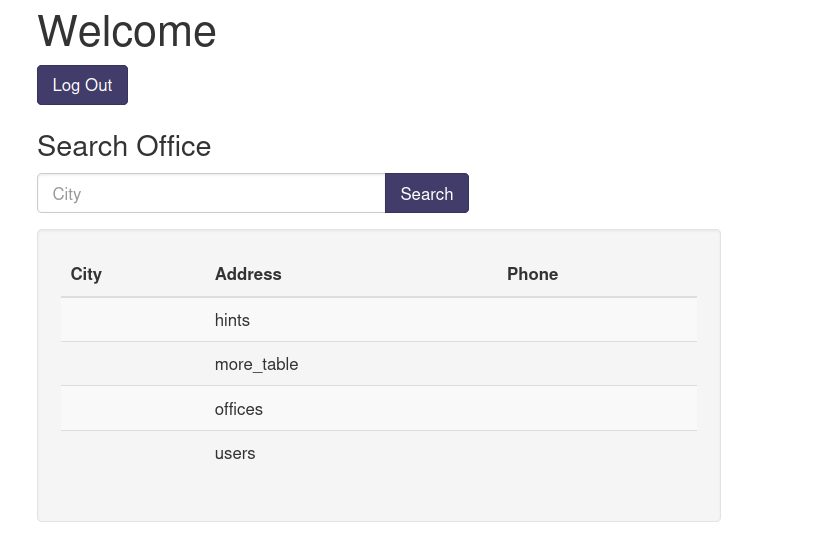
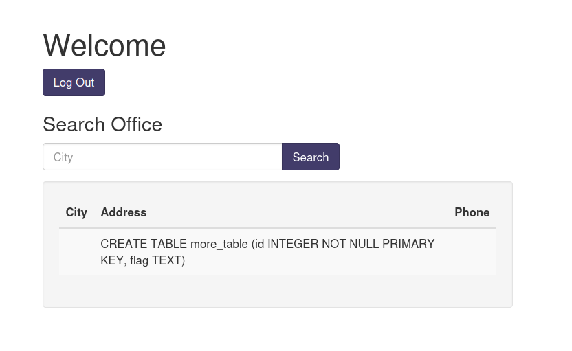
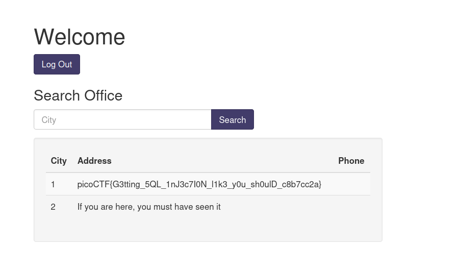

# More SQLi

## Objective
- To find the flag using SQLinjection

## Intial Observations
- I could not get the website to work with burpsuite active.
- There is nothing interesting when inspecting the webpage.
- Inputting any details:

Gives:

 
## Approach
- Since the password comes before username in the query, I can just manipulate the password and comment out the rest to bypass the `AND`
- My password should be of the form `something'--`, so that the `AND` part gets commented out
- If I use `a' OR 1=1--` as the password the `WHERE` condition should always be true, as the `AND` part will get replaced by `OR 1=1` which is always true
- I put a random username and the above mentioned password, I got the following window: 

- This suggests I somehow have to search for all the tables
- Searched how to get all the tables from SQLite using injection
- On researching and asking ChatGPT, 
    
    System table sqlite_master stores metadata about the database structure, including table names.

    `' UNION SELECT NULL, name, NULL FROM sqlite_master WHERE type='table' --` is a typical query used to retrive table names

    `NULL` is a placeholder to match the number of columns 
- Entering the above mentioned query:

- Found out the flag is in the more_table by using the following
`' UNION SELECT NULL, sql, NULL FROM sqlite_master WHERE name='table_name' --` this displays the `CREATE TABLE` used for the table_name (table_name is a placeholder for name of the table)

- To extract data from the `more_table`
`' UNION SELECT id, flag, NULL FROM more_table --`

## Flag
picoCTF{G3tting_5QL_1nJ3c7I0N_l1k3_y0u_sh0ulD_c8b7cc2a}

