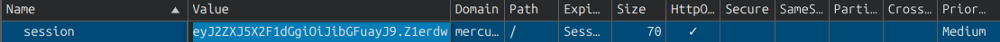
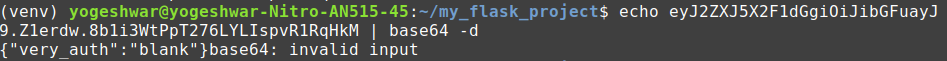
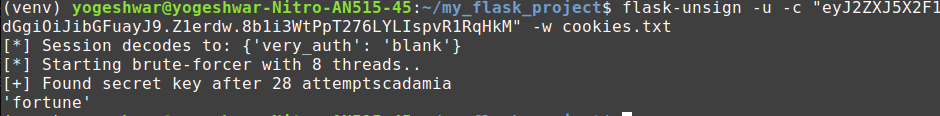
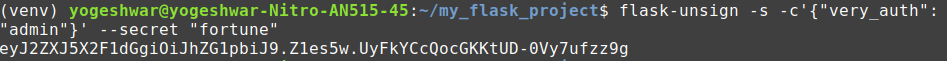
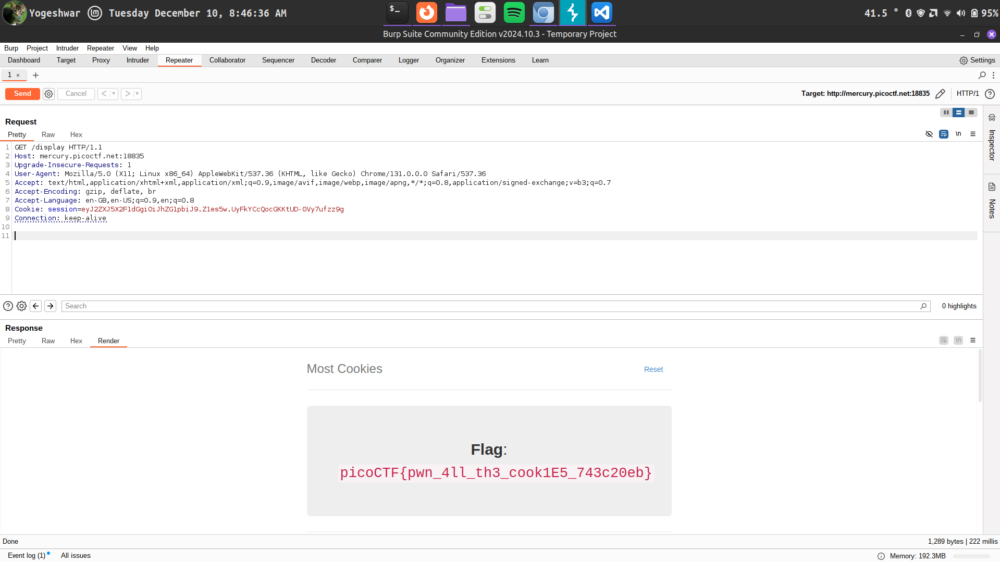

## Most Cookies
- trying to find a way to decode flask session cookie
- [Flask Session Cookie Decoder](https://www.kirsle.net/wizards/flask-session.cgi) did not work
- `server.py` file:
        
        from flask import Flask, render_template, request, url_for, redirect, make_response, flash, session
        import random
        app = Flask(__name__)
        flag_value = open("./flag").read().rstrip()
        title = "Most Cookies"
        cookie_names = ["snickerdoodle", "chocolate chip", "oatmeal raisin", "gingersnap", "shortbread", "peanut butter", "whoopie pie", "sugar", "molasses", "kiss", "biscotti", "butter", "spritz", "snowball", "drop", "thumbprint", "pinwheel", "wafer", "macaroon", "fortune", "crinkle", "icebox", "gingerbread", "tassie", "lebkuchen", "macaron", "black and white", "white chocolate macadamia"]
        app.secret_key = random.choice(cookie_names)

        @app.route("/")
        def main():
            if session.get("very_auth"):
                check = session["very_auth"]
                if check == "blank":
                    return render_template("index.html", title=title)
                else:
                    return make_response(redirect("/display"))
            else:
                resp = make_response(redirect("/"))
                session["very_auth"] = "blank"
                return resp

        @app.route("/search", methods=["GET", "POST"])
        def search():
            if "name" in request.form and request.form["name"] in cookie_names:
                resp = make_response(redirect("/display"))
                session["very_auth"] = request.form["name"]
                return resp
            else:
                message = "That doesn't appear to be a valid cookie."
                category = "danger"
                flash(message, category)
                resp = make_response(redirect("/"))
                session["very_auth"] = "blank"
                return resp

        @app.route("/reset")
        def reset():
            resp = make_response(redirect("/"))
            session.pop("very_auth", None)
            return resp

        @app.route("/display", methods=["GET"])
        def flag():
            if session.get("very_auth"):
                check = session["very_auth"]
                if check == "admin":
                    resp = make_response(render_template("flag.html", value=flag_value, title=title))
                    return resp
                flash("That is a cookie! Not very special though...", "success")
                return render_template("not-flag.html", title=title, cookie_name=session["very_auth"])
            else:
                resp = make_response(redirect("/"))
                session["very_auth"] = "blank"
                return resp

        if __name__ == "__main__":
            app.run()
        
- so the secret key will reset on every reload(?)
- no it does not
- for the secret key to reset, you have to restart the flask application, not reload. Reloading just sends the request you had to send to get the current response, again.
- i tried every cookie name listed but no success, ot just shows 
"That is a cookie! Not very special though..."
- the code never uses the secret key after randomising it
- ended up searching for solution
- came across flask-usign
- my current cookie

- the format of the cookie is `Payload.Timestamp.Signature`
- decoding the cookie:
 

- according to `server.py` file we want the `very_auth` part of the cookie to be equal to `admin`
- to craft a cookie with desired payload, we need to find the secret key which is randomised

- now to craft the cookie

- appending it to the request

- flag!

[flask-unsign-info](https://pypi.org/project/flask-unsign/)

  

